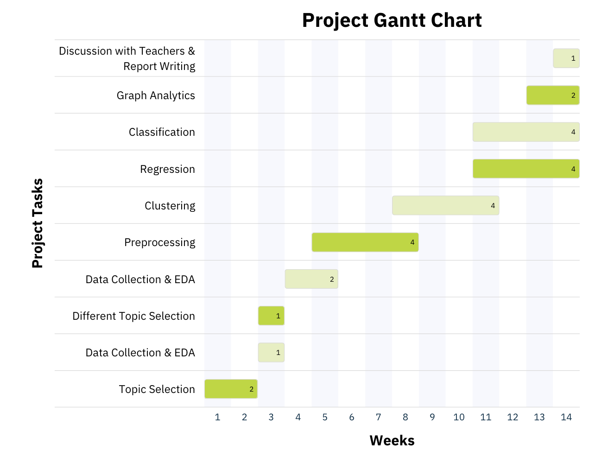

# Big Data Analytics: Project

## Team Members
- Alexandre Gonçalves
- Bruna Simões
- Catarina Ribeirinha
- Marco Galão
- Margarida Cardoso

## Project Overview
This repository contains materials for our Big Data Analytics project, where we tackle a real-world Big Data problem by collecting, processing, and analyzing large datasets using Apache Spark, machine learning, and visualization tools to extract meaningful insights and present our findings.

